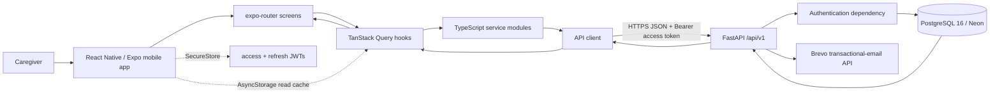

# CareKosh: voice-agent knowledge pack

> **Purpose:** This compact, source-verified brief gives a conversational assistant an accurate end-to-end picture of CareKosh (formerly VitalTrack): the mobile UI, HTTP API, authentication, database, deployment, and the engineering reasoning behind them. It is designed for learning, system-design discussion, and interview rehearsal.
>
> **Source-of-truth note:** The directory names `vitaltrack-mobile/` and `vitaltrack-backend/` are legacy names. The product shown to users is **CareKosh**. Do not infer that the product is two different applications.

## 1. What the product does

CareKosh is a mobile inventory-management application for family caregivers managing a home ICU. It records medical supplies, stock counts, reorder thresholds, expiry information, and criticality. It highlights low/out-of-stock supplies, creates purchase orders, applies received orders to stock, and records user-visible activity and selected detailed audit snapshots.

The important product constraint drives the architecture: incorrect inventory writes can be dangerous. CareKosh therefore chose **server-first**, rather than offline-first, data management. The server and PostgreSQL database are authoritative. The mobile client may display a cached *read-only snapshot* when offline, but it never queues mutations or later pushes cached writes to the server.

## 2. System map



| Layer | Technology | Responsibility |
|---|---|---|
| Mobile UI | React Native, Expo SDK 54, TypeScript, expo-router | Screens, forms, navigation, user feedback |
| Client state | Zustand + TanStack Query | Zustand stores UI/auth state; Query stores server data and invalidates after mutations |
| Client storage | Expo SecureStore + AsyncStorage | SecureStore holds tokens; AsyncStorage holds a display-only query cache |
| API | FastAPI + Pydantic | REST contract, request validation, auth and ownership checks |
| Persistence | SQLAlchemy 2 async + Alembic | Async sessions, ORM models, schema migration |
| Database | PostgreSQL 16 / Neon | System of record; all business data is user-scoped |
| Infrastructure | Render + Docker + EAS | Backend deployment and Android preview/production builds |
| Email | Brevo HTTP API | Verification, password-reset, password-change, deletion confirmation mail |

## 3. Runtime and deployment topology

1. The Expo app receives `EXPO_PUBLIC_API_URL` at build time.
   - Local development: `http://localhost:8000` (or LAN/ADB override for a device)
   - Preview APK: `https://staging-api.carekosh.com`
   - Production AAB: `https://api.carekosh.com`
2. The API is a Dockerized FastAPI service on Render. Its entrypoint waits for PostgreSQL, runs `alembic upgrade head`, then starts the application server.
3. Production and staging use Neon PostgreSQL over SSL. The database engine uses `asyncpg`, pooling, `pool_pre_ping`, and an 8-second PostgreSQL statement timeout.
4. `/live` tests whether the API process is alive; `/health` also runs `SELECT 1` and returns 503 if the database is not ready.
5. The FastAPI application mounts a versioned REST surface at `/api/v1`; it also adds request IDs, security headers, error handlers, rate limiting, and CORS configuration.

## 4. Mobile app flow

### Navigation and access control

- `app/_layout.tsx` initializes the auth and UI stores, mounts the TanStack Query provider, and uses an Expo Router route guard.
- Unauthenticated users are redirected to `/(auth)/login`.
- Authenticated users in the auth route group are redirected to `/(tabs)`.
- Auth screens: login, registration, verification-pending, forgot-password, reset-password.
- Main screens: Dashboard, Inventory, Orders, item editor, order creator, profile, and search.

### Normal read path

```text
Screen -> useServerData hook -> service (items/categories/orders)
       -> ApiClient -> GET /api/v1/... -> FastAPI route
       -> CurrentUser dependency -> user-scoped SQL query -> PostgreSQL
       -> JSON response -> React Query cache -> screen
```

For example, the Dashboard calls `useStats`, `useItems`, `useOrders`, and `useActivities`. Inventory calls `useItems` and `useCategories`. The React Query cache becomes stale after 30 seconds, refetches when the app returns to the foreground or reconnects, and is invalidated immediately after a successful mutation.

### Normal write path

```text
Form / button -> useServerMutations hook -> service -> ApiClient
              -> authenticated REST mutation -> FastAPI + PostgreSQL transaction
              -> JSON response -> invalidate affected query keys -> refetch UI
```

Mutations have `retry: 0`: a write is not automatically replayed by the client. This is deliberate because retrying an uncertain inventory operation could duplicate a sensitive action. The UI gives clear success/failure feedback and, where appropriate, offers an explicit retry.

### Cache behavior and shared-device privacy

- The app persists selected Query data for up to 24 hours in AsyncStorage so cached inventory/orders/categories can be displayed while offline.
- Cached data only travels **server -> cache -> UI**. It is never a sync queue and is never sent back to the backend.
- Authentication queries are excluded from persisted cache.
- On both login and logout, the app clears the in-memory Query cache and the persisted AsyncStorage cache. This prevents a second caregiver using the same device from seeing the previous account's data.
- SecureStore holds the access and refresh tokens; the Zustand auth state is persisted through a SecureStore adapter.

## 5. Authentication and authorization, end to end

### Login session lifecycle

```mermaid
sequenceDiagram
  participant App as Mobile app
  participant API as FastAPI
  participant DB as PostgreSQL
  App->>API: POST /api/v1/auth/login {identifier, password}
  API->>DB: find user by lowercase email or username
  API->>API: Argon2 password verification
  API->>DB: insert refresh_tokens row (jti, user_id, expiry, metadata)
  API-->>App: short access JWT + long refresh JWT + user
  App->>App: store both tokens in Expo SecureStore
  App->>API: protected request with Authorization: Bearer access JWT
  API->>API: decode JWT, enforce token type=access
  API->>DB: load active user; query only their records
  API-->>App: user-scoped response
```

**Passwords:** The backend hashes passwords using Argon2 via Passlib (bcrypt remains a deprecated fallback for legacy hashes). Password verification is run off the async event loop using `anyio.to_thread.run_sync`.

**Access token:** A signed HS256 JWT with `sub` (user UUID), `exp`, `iat`, and `type: "access"`. Its default lifetime is 30 minutes.

**Refresh token:** A signed HS256 JWT with the same identity claims plus a unique `jti` and `type: "refresh"`. Its default lifetime is 30 days. A corresponding `refresh_tokens` database row makes revocation possible—so this is not a purely stateless JWT design.

**Authorization:** `get_current_user` extracts the HTTP Bearer token, verifies it is an access token, loads the user from the DB, and rejects missing, invalid, inactive, or deleted accounts. Every resources route then filters by `current_user.id`; knowing another record ID must not grant access to it.

### Registration and email verification

1. The Registration screen -> auth store -> `POST /auth/register`.
2. The backend validates identifier uniqueness, hashes the password, creates an unverified user, generates a 32-byte URL-safe verification secret, and stores only `SHA-256(raw_token)` plus an expiry on the user row.
3. If Brevo is configured, FastAPI `BackgroundTasks` sends an email link containing the raw token. The default verification-link lifetime is 24 hours.
4. The backend currently returns a token pair for backwards compatibility and records the initial refresh-token row. The **mobile auth store immediately clears those tokens** after successful registration, then sends the user to the verification-pending screen. Registration therefore does not create an app session.
5. Clicking the link hits either the browser-friendly `/auth/verify-email?token=...` page or the JSON `/auth/verify-email/{token}` endpoint. The backend compares token hashes with `secrets.compare_digest`, marks `is_email_verified=True`, and clears the stored verification token.
6. The user logs in freshly after verification.

**Important configuration nuance:** Login blocks an unverified email account only when both `REQUIRE_EMAIL_VERIFICATION=true` **and** the email service is configured. The production Render configuration sets the flag true. The development defaults set it false so a locally unavailable email provider does not make local accounts unusable. The code uses `is_email_verified` for this check; `is_verified` remains a separate legacy model field.

### Automatic access-token refresh

1. The client sends the access JWT on protected requests.
2. A 401 initiates `POST /auth/refresh` with the SecureStore refresh token.
3. The client allows only one refresh call at a time. Other requests wait for the result, then replay once with the replacement access token.
4. The backend validates the refresh JWT and performs an atomic `UPDATE ... WHERE is_revoked=false` to claim and revoke its `jti` row. This prevents two simultaneous refresh calls from rotating the same token twice.
5. The backend inserts a new refresh-token row with a new `jti` and returns a new token pair; the app replaces both SecureStore tokens.
6. If refresh fails, client tokens are cleared and an authenticated session is logged out, returning the user to login.

### Logout, password changes, password reset, and account deletion

| Flow | What happens |
|---|---|
| Logout | The app calls `/auth/logout` with the refresh token when possible; the API revokes its row. The client clears SecureStore tokens, React Query memory/disk cache, UI state, and auth state even if the network request fails. |
| Change password | Authenticated `/auth/change-password` verifies the current Argon2 password, updates the hash, and revokes all refresh-token rows. Other devices must log in again. |
| Forgot/reset password | The public endpoint always returns a generic success response for existing/non-existing email addresses (prevents email enumeration). It stores only a SHA-256 hash of a short-lived reset token (default one hour). On successful reset it clears the token, writes the password hash, and revokes every refresh token. The browser reset page HTML-escapes the URL token before putting it in a DOM data attribute. |
| Account deletion | Authenticated `DELETE /auth/me` generates a 24-hour, hash-only confirmation token and emails a link. The browser page requires a second explicit form submission before deleting the user. SQLAlchemy relationships and database foreign keys cascade removal of the user's categories, items, orders/order items, activities, and refresh tokens. |

### Other defensive controls

- Endpoint-specific rate limits: register 3/hour, login 5/minute, resend verification 3/hour, forgot password 3/hour, reset password 5/hour (per IP through SlowAPI).
- Error responses avoid database details; `IntegrityError` becomes HTTP 409.
- The API adds `X-Request-ID`, `X-Content-Type-Options: nosniff`, `X-Frame-Options: DENY`, restrictive referrer policy, `Cache-Control: no-store`, and production HSTS.
- Production settings reject a weak `SECRET_KEY`; config values are read by Pydantic Settings. Never upload a real `.env` file.

## 6. REST surface and business flows

All of these routes sit below `/api/v1` and, except public auth routes, use `CurrentUser`.

| Area | Main endpoints | Key behavior |
|---|---|---|
| Auth | `/auth/register`, `/login`, `/refresh`, `/logout`, `/me`, verification, reset, change password, deletion | JWT session lifecycle, revocation, email token workflows |
| Categories | `/categories`, `/categories/with-counts`, `/{id}` | User-owned organization of items; default categories cannot be deleted |
| Items | `/items`, `/items/stats`, `/items/needs-attention`, `/{id}`, `/{id}/stock` | CRUD, search/filter/pagination, low-stock and critical logic, optimistic concurrency |
| Orders | `/orders`, `/{id}/status`, `/{id}/apply` | Order lifecycle and transactional stock application |
| Activities | `/activities?limit=` | User-visible activity timeline (default 50; max 200) |

### Inventory flow

- Creating an item verifies the category belongs to the user and rejects duplicate item names case-insensitively within that user's inventory.
- Item records include quantity, unit, minimum stock, expiry date, supplier details, active/critical flags, and a `version` column.
- `GET /items/needs-attention` returns active items that are out of stock or below their threshold, ordered to prioritize zero quantity and criticality.
- Update and quick-stock endpoints use **optimistic concurrency control (OCC)**. The client must send its `version`. The backend uses an atomic compare-and-swap condition: `WHERE item.id AND user_id AND version`. A stale write returns HTTP 409 with the server's version and quantity rather than silently overwriting another caregiver's edit.
- Item mutations append an `activity_logs` entry. They also write a detailed `audit_log` snapshot of the before/after relevant values inside the same transaction.

### Purchase-order-to-stock flow

```mermaid
sequenceDiagram
  participant UI as Orders screen
  participant API as FastAPI
  participant DB as PostgreSQL
  UI->>API: POST /orders (item snapshots + quantities)
  API->>DB: validate every item belongs to user; create order + order_items
  API-->>UI: pending order
  UI->>API: PATCH /orders/{id}/status -> received
  API->>DB: atomic allowed status transition
  UI->>API: POST /orders/{id}/apply
  API->>DB: atomically claim order only if received
  API->>DB: increment each current item quantity and version
  API->>DB: activity + per-item audit snapshots, one commit
  API-->>UI: order now stock_updated
  UI->>UI: invalidate items, orders, activities queries
```

Valid status paths are `pending -> ordered/received/declined`, `ordered -> partially_received/received`, and `partially_received -> received`. `stock_updated` may be reached only by `POST /orders/{id}/apply`, not a generic status PATCH.

The apply endpoint first verifies every referenced inventory item still exists and belongs to the current user, then atomically claims only an order that is still `received`. It increments `quantity` and `version` for each line item, adds audit/activity entries, and commits once. This protects against double-application and partial application caused by a missing item.

## 7. Database model and ownership boundaries

```text
users
 ├─< refresh_tokens         (revocable session records)
 ├─< categories ─< items    (inventory; item has version)
 ├─< orders ─< order_items  (snapshot lines that reference item IDs)
 ├─< activity_logs          (user-facing events)
 └─< audit_log              (selected detailed before/after snapshots)
```

- Primary IDs are UUID-like strings; `created_at` and `updated_at` are timezone-aware timestamps on the usual entities.
- User relationships use `cascade="all, delete-orphan"`; foreign keys use `ON DELETE CASCADE` where modeled. This supports full data deletion when a user account is deleted.
- `order_items` preserve a snapshot of name, brand, unit, current stock, minimum stock, supplier, and purchase link at order creation. That preserves historical order context even if an inventory item changes later.
- `activity_logs` power the user-facing recent activity feed. Some auth/sync-shaped events are filtered from the mobile display.
- `audit_log` is a separate PostgreSQL JSONB before/after trail currently written for item create/update/stock/delete and stock updates caused by applying an order. Do not describe it as complete audit coverage for every endpoint.

## 8. Key system-design decisions worth explaining in an interview

1. **Server-first instead of offline writes:** In life-critical inventory, resolving multi-device merge conflicts after the fact is unsafe. The backend is authoritative; offline support is limited to display cache.
2. **Read cache versus sync queue:** The Query cache gives resilient launches and short offline visibility without introducing eventual-consistency write complexity.
3. **Short access JWT + rotating, server-tracked refresh JWT:** Access tokens reduce database work on normal requests; a refresh-token table enables logout, password-reset invalidation, rotation, and replay prevention.
4. **Defense in depth for authorization:** A valid JWT establishes identity, then every query is constrained to `current_user.id`. Auth alone is not sufficient authorization.
5. **OCC and atomic state transitions:** Version checks prevent lost inventory updates. Conditional SQL updates also prevent concurrent order-state transitions and duplicate stock application.
6. **Transactions with audit data:** Item writes and their audit entries are committed together; order application changes status, stock, activities, and audit snapshots in one transaction.
7. **Async web stack:** FastAPI, SQLAlchemy async sessions, and asyncpg improve concurrent I/O handling. CPU-bound Argon2 work moves to a worker thread to avoid blocking the event loop.
8. **Health distinction:** `/live` determines whether the process should be restarted; `/health` determines whether the API is actually ready to serve database-backed requests.

## 9. Source files to consult when more detail is needed

This brief is an explanation, not a replacement for the implementation. Use these files to answer exact code questions:

| Question | Primary source files |
|---|---|
| App routing and top-level providers | `vitaltrack-mobile/app/_layout.tsx`, `vitaltrack-mobile/app/(tabs)/_layout.tsx` |
| Client authentication and storage | `vitaltrack-mobile/store/useAuthStore.ts`, `vitaltrack-mobile/services/auth.ts`, `vitaltrack-mobile/services/api.ts` |
| Queries and mutation invalidation | `vitaltrack-mobile/hooks/useServerData.ts`, `vitaltrack-mobile/hooks/useServerMutations.ts`, `vitaltrack-mobile/providers/QueryProvider.tsx` |
| API route registration, middleware, health | `vitaltrack-backend/app/main.py`, `vitaltrack-backend/app/api/v1/__init__.py` |
| Auth implementation | `vitaltrack-backend/app/api/v1/auth.py`, `vitaltrack-backend/app/core/security.py`, `vitaltrack-backend/app/api/deps.py`, `vitaltrack-backend/app/utils/email.py` |
| Inventory/order business logic | `vitaltrack-backend/app/api/v1/items.py`, `vitaltrack-backend/app/api/v1/orders.py`, `vitaltrack-backend/app/api/v1/categories.py`, `vitaltrack-backend/app/api/v1/activity.py` |
| Data model, transactions, audit | `vitaltrack-backend/app/models/*.py`, `vitaltrack-backend/app/core/database.py`, `vitaltrack-backend/app/services/audit.py`, `vitaltrack-backend/alembic/versions/*.py` |
| Environments and deployment | `vitaltrack-mobile/eas.json`, `vitaltrack-backend/render.yaml`, `vitaltrack-backend/docker-entrypoint.sh`, root `README.md` |

## 10. Boundaries for the assistant

- Do **not** invent fields, routes, data flows, external services, or security guarantees that are not represented here or in the attached source files.
- Call out configuration-dependent behavior, particularly email verification and CORS.
- Distinguish what is implemented today from future ideas in `future_plan/`.
- Never request or expose `.env`, credentials, tokens, database URLs, service-account keys, or production data. `.env.example` files are safe examples; real `.env` files are not.
- This is education and engineering discussion, not clinical advice. The project tracks medical inventory but does not make medical decisions.
