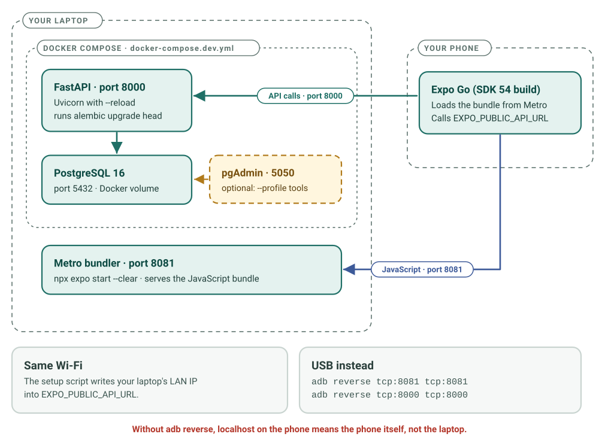

# New Developer Quick Start

> **AI voice source update — 9 October 2026:** Current AI voice architecture, checked against the 9 October 2026 working tree at `0946eb7` plus local UI/capture changes: Android AudioRecord → Moonshine provisional live words → offline Moonshine or separately opted-in Groq Whisper final transcript → review/edit and Send → local parser or consented Groq GPT-OSS v2 specification → validated real inventory answers/local unsaved drafts. Device TTS and PDF rendering are local. Only touch confirmation saves an order; voice cannot change stock. Groq text and audio permissions are separate; hosted speech/Sarvam are not selected. Earlier dated test/release claims retain their original scope. This source review does not certify live deployment, account billing, all phones or recognition accuracy. [Complete stack, request flow, consent, costs and code map](VOICE_INVENTORY_AND_ORDER_DRAFTS.md).


> 8 October 2026 safety follow-up: targeted code fixes are local, tested changes after the earlier audit. Deployment and real-device acceptance remain separate. [Current changes and remaining scope](BACKEND_HARDENING.md#safety-follow-up-8-october-2026).

> **Status (re-checked 8 October 2026):** Checked against the working tree at at branch `feature/backend-hardening-ai-voice-agent-foundation`, commit `03cfebb` (not merged into `main`). Start with the [documentation index](INDEX.html); the main onboarding guide is the [Complete Developer Guide](CAREKOSH_COMPLETE_DEVELOPER_GUIDE.md) and every endpoint is traced in [API traceability](API_TRACEABILITY.md).
>
> - **Database:** the newest migration is `0010_order_local_id_unique`. Migrations `0007`–`0010` exist only on the feature branch; `0007` cannot be rolled back automatically, so they must reach production through the [release gate](CAREKOSH_COMPLETE_DEVELOPER_GUIDE.md#f5-database-migrations-and-the-0007-0010-release-gate). Locally, Docker applies them for you.
> - **Tests:** re-run on 8 October 2026 against a disposable local PostgreSQL 16 database: **242 backend tests** (on an Alembic-built schema) and **121 mobile tests** (`npm test`) passed, as on 7 Oct; GitHub Actions run 37583748644 on the same commit also passed (7 Oct). Type checking (mypy) and the security scan are advisory; the `main` ruleset read on 7 Oct required no status checks at all.
> - Earlier dated counts in other documents (152 backend tests, 8 mobile tests, head `0007`) are historical.

> **Time required:** about 30 minutes
> **Goal:** CareKosh running locally, with the backend and the mobile app connected, and you able to register and log in.

This file is the fast path. For the full reference, see the [Complete Developer Guide](CAREKOSH_COMPLETE_DEVELOPER_GUIDE.md) and the concise repo-root [CAREKOSH_DEVELOPER_GUIDE.md](../CAREKOSH_DEVELOPER_GUIDE.md). The guides should agree. Where they differ, the source files each section cites (for example `package.json`, `docker-compose.dev.yml`, `ci.yml`) are authoritative; please report the discrepancy.

## The setup at a glance



When you finish, three things run on your laptop (the API, the database and Metro) and one on your phone (Expo Go). On the phone, `localhost` means the phone itself (unless you use `adb reverse` over USB), which is why the setup script writes your laptop's LAN IP into the app's `.env`.

---

## Prerequisites

- **Docker Desktop** — [download](https://www.docker.com/products/docker-desktop/). It must be running.
- **Node.js 22**, as pinned in `vitaltrack-mobile/.nvmrc` (CI's frontend job still uses Node 20). React Native 0.81 needs at least Node 20.19.4, so early Node 20 releases fail. Check with `node --version`.
- **Git**
- **Expo Go for SDK 54** on your Android phone. This project uses Expo SDK 54, but the Play Store version of Expo Go follows the newest SDK. Install the SDK 54 build from <https://expo.dev/go> (choose SDK 54 → Android).
  - If Expo Go says *"Project is incompatible with this version of Expo Go"*, you have the wrong build.
  - The alternative is a development build (`eas.json` profile `development`, a debug APK) when you need native modules. It first needs `expo-dev-client` added to the project; that package is not installed today, so the profile cannot be built yet.
  - **Voice assistant microphone:** the on-device speech module (`modules/carekosh-voice`, Kotlin) cannot load in Expo Go. Typed assistant questions work in Expo Go; recording needs an EAS-built APK (a `preview` build talks to staging). See [the voice chapter](CAREKOSH_COMPLETE_DEVELOPER_GUIDE.md#c7-the-voice-and-typed-assistant).
- The phone and the PC on the **same Wi-Fi network**. Alternatively, connect by USB with `adb reverse`; see [USB_ADB_REVERSE_GUIDE.md](USB_ADB_REVERSE_GUIDE.md).

---

## Step 1 — Clone (2 min)

```bash
git clone https://github.com/rishabhrd09/vitaltrack.git
cd vitaltrack
```

The repository is called `vitaltrack` for legacy reasons; the product is **CareKosh**. The directory names `vitaltrack-backend/` and `vitaltrack-mobile/` are deliberately unchanged.

---

## Step 2 — Environment setup (2–4 min; the script also runs `npm install`)

**Windows**
```cmd
setup-local-dev.bat
```

**macOS / Linux**
```bash
bash setup-local-dev.sh     # the file is not marked executable in Git; `bash` avoids changing its mode
```

The script:

1. checks that `node`, `npm`, `git` and `docker` are installed;
2. detects your LAN IP address;
3. creates `vitaltrack-backend/.env` and `vitaltrack-mobile/.env`, seeded with that IP (`EXPO_PUBLIC_API_URL=http://<your LAN IP>:8000`) — **only if they do not exist yet**;
4. runs `npm install` in `vitaltrack-mobile/`;
5. prints "Setup Complete!".

Re-running the script does **not** overwrite existing `.env` files. After your IP changes (for example, on a new Wi-Fi network), see the setup note under [Common commands](#common-commands).

---

## Step 3 — Start the backend (5 min)

```bash
cd vitaltrack-backend
docker compose -f docker-compose.dev.yml up --build -d
docker compose -f docker-compose.dev.yml logs -f api
```

Wait for `Uvicorn running on http://0.0.0.0:8000` followed by `Application startup complete.` Each log line starts with a prefix that depends on your Compose version and the container name, `vitaltrack-api-dev`.

What happens inside: the development container uses the inline entrypoint in `Dockerfile.dev`. It waits for the database at `db:5432`, runs `alembic upgrade head`, then starts Uvicorn with `--reload` (the server restarts when you edit code). If the migration fails, this container still starts the server (known issue A-17), so read the log. Production uses `docker-entrypoint.sh` and Gunicorn instead. In both Docker flows you do not run migrations by hand.

**Verify:** <http://localhost:8000/health> returns `status: "healthy"` with `database: "connected"`.
**API docs:** <http://localhost:8000/docs>

**Local safety:** the Compose file publishes PostgreSQL (user and password `postgres`) on port 5432, and pgAdmin (password `admin`, only with `--profile tools`) on port 5050, on every network interface of your laptop. Use a trusted Wi-Fi network.

Keep this terminal running and open a new one for the next step.

---

## Step 4 — Start the mobile app (5 min)

```bash
cd vitaltrack-mobile
npm install --legacy-peer-deps
npx expo start --clear
```

- `npm install` was already run by the setup script; running it again is harmless. `vitaltrack-mobile/.npmrc` already sets `legacy-peer-deps=true`, so the flag only makes that explicit.
- `npx expo start` uses the API URL in `vitaltrack-mobile/.env`, which is your LAN IP. `--clear` empties Metro's bundler cache.
- For a USB connection instead of Wi-Fi, see the "Phone can't reach backend" row under [Troubleshooting](#troubleshooting).

Expect a QR code in the terminal and `Metro waiting on exp://…`.

---

## Step 5 — On your phone (2 min)

1. Open **Expo Go** (the SDK 54 build).
2. Scan the QR code.
3. Wait about 30 seconds while Metro builds the first bundle.
4. Tap **Create Account** and enter your name, email and password. The app then shows the *verify email* screen. **Registration never signs you in.**
5. Tap **I've Verified — Go to Login** and log in.
   - The Docker development flow sets `REQUIRE_EMAIL_VERIFICATION=true`, but the backend only enforces it when email sending is configured.
   - With `MAIL_PASSWORD` blank (the default), no email is sent and login works immediately. This avoids locking you out locally.
   - With Brevo configured (`MAIL_PASSWORD` set), open the emailed link first, then log in.
6. The dashboard opens.

Staging and production are intended to enforce verification. `render.yaml` sets `REQUIRE_EMAIL_VERIFICATION=true` for production, and enforcement also needs `MAIL_PASSWORD` in that service. Neither setting can be confirmed from the repository; check both in each Render dashboard. See [EMAIL_VERIFICATION_GUIDE.md](EMAIL_VERIFICATION_GUIDE.md).

Success: CareKosh is running locally.

---

## Verification checklist

```
□ Backend
  □ docker ps shows 2 containers (vitaltrack-api-dev + vitaltrack-db-dev)
  □ http://localhost:8000/health returns status healthy with database connected
  □ http://localhost:8000/docs shows Swagger UI
  □ docker compose -f docker-compose.dev.yml exec api alembic current
    prints 0010_order_local_id_unique (head), and `alembic heads` lists exactly one head

□ Mobile
  □ QR code shown, no red errors
  □ Metro says "Metro waiting on exp://…"

□ Device
  □ Expo Go (SDK 54 build) scans the QR and opens the app
  □ After registering, logging in opens the dashboard
  □ Creating an item works; the activity log updates
```

---

## Troubleshooting

| Problem | Fix |
|---|---|
| Expo Go says "Project is incompatible with this version of Expo Go" | You have the Play Store build, which follows the newest SDK. Install the SDK 54 build from <https://expo.dev/go>. |
| App shows "Unable to connect to server…" (the Metro log shows "Network request failed") | The API URL is wrong or the backend is unreachable. Check `EXPO_PUBLIC_API_URL` in `vitaltrack-mobile/.env` (your current LAN IP), then fully reload the app. If you switch backends, restart Metro with the intended `npm run start:*` script. Or use USB (next row). |
| Phone can't reach backend | Use USB: run `adb reverse tcp:8000 tcp:8000` and `adb reverse tcp:8081 tcp:8081`. Then run `npm run start:local`, or set `EXPO_PUBLIC_API_URL=http://localhost:8000` in `vitaltrack-mobile/.env`, and fully reload the app. See [USB_ADB_REVERSE_GUIDE.md](USB_ADB_REVERSE_GUIDE.md). |
| Phone on Wi-Fi still can't reach port 8000 | The laptop firewall may block it. On Windows, `fix-firewall.ps1` (run as Administrator) opens port 8000 on **Private and Public** networks and has no undo script; remove the rule later with `Remove-NetFirewallRule -DisplayName VitalTrack-Backend-8000`. |
| Docker not starting | Docker Desktop must be running (tray or menu-bar icon). |
| `npm install` fails | Use `npm install --legacy-peer-deps`. React Native packages often have peer-dependency conflicts; `vitaltrack-mobile/.npmrc` already sets this flag. |
| Port 5432 conflict | A local PostgreSQL is running. Stop it, or change the host-side port in `docker-compose.dev.yml`. |
| "Database not ready... waiting 2s" in the backend logs | Normal while the development entrypoint waits for `db:5432`. Wait for the `Application startup complete` log line. |
| Assistant says "Voice recording needs the Android preview app" | Expected in Expo Go: the native speech module is not available there. Type the question instead, or install an EAS-built APK. |

Deep dive: [LOCAL_TESTING_COMPLETE_GUIDE.md](LOCAL_TESTING_COMPLETE_GUIDE.md).

---

## Common commands

```bash
# Backend (run in vitaltrack-backend/)
docker compose -f docker-compose.dev.yml up --build -d      # start
docker compose -f docker-compose.dev.yml down               # stop (keeps the database volume)
docker compose -f docker-compose.dev.yml down -v            # stop AND wipe the local database
docker compose -f docker-compose.dev.yml logs -f api        # follow the API logs

# Mobile (run in vitaltrack-mobile/)
npx expo start                  # dev server, API URL from .env
npx expo start --clear          # same, after clearing Metro's cache
npm run start:local             # API at http://localhost:8000 (USB with adb reverse)
npx expo start --tunnel         # serves only the JS bundle via ngrok (needs @expo/ngrok);
                                # the API URL is unchanged, so the phone must still reach
                                # port 8000 (LAN IP, or USB with adb reverse + http://localhost:8000)

# Setup
bash setup-local-dev.sh         # first-time setup; does NOT overwrite existing .env files

# Tests (see the Complete Developer Guide, Part E, for the safe database setup)
cd vitaltrack-mobile && npm test                        # 121 tests, no server needed
# Backend tests DROP ALL TABLES in their database: only use a throwaway
# PostgreSQL whose database name contains "test" (never your Docker dev DB).
```

**After an IP change:** re-running setup is not enough, because it skips existing `.env` files. Either edit `vitaltrack-mobile/.env` (`EXPO_PUBLIC_API_URL`) and `vitaltrack-backend/.env` (`LOCAL_IP`, `FRONTEND_URL`), or delete both files and re-run the script. Then restart Compose and reload the app.

---

## Next steps

1. **Pick a first task** — see [CAREKOSH_ROADMAP.md](../CAREKOSH_ROADMAP.md).
2. **Learn the Git flow** — [GIT_WORKFLOW_GUIDE.md](GIT_WORKFLOW_GUIDE.md).
3. **Understand the architecture** — the [Complete Developer Guide](CAREKOSH_COMPLETE_DEVELOPER_GUIDE.md) (start with Parts A–C), [CAREKOSH_DEVELOPER_GUIDE.md §1](../CAREKOSH_DEVELOPER_GUIDE.md#1-architecture-overview) and the architecture diagrams page at the repository root (`carekosh_architecture_diagrams.html`).
4. **Contribute** — [CAREKOSH_DEVELOPER_GUIDE.md §12](../CAREKOSH_DEVELOPER_GUIDE.md#12-contribution-workflow) covers branch names, the commit convention and the PR flow.

Questions? Open a GitHub issue or tag `@rishabhrd09`.

---

*Checked 7 October 2026 and re-checked 8 October 2026 against commit `03cfebb` (feature branch) plus the uncommitted working-tree changes. Earlier reviews: 2026-05-04 (PR #34) and 2026-09-23 (September hardening, head `0007`). For the mobile UX features added on 2026-05-04 (status pill, mutation result dialog, fire-and-forget saves), see [the history section of the Complete Developer Guide](CAREKOSH_COMPLETE_DEVELOPER_GUIDE.md#g7-history-of-this-guide).*
