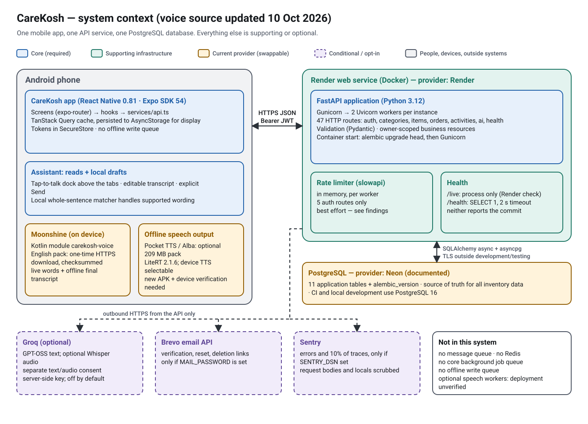
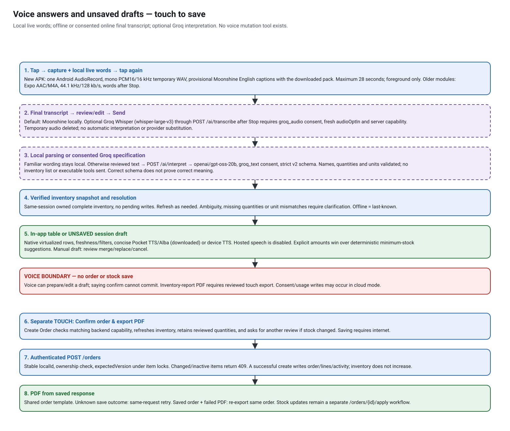

# Inventory answers and voice-prepared order drafts

Current local implementation: 10 October 2026, on `feature/backend-hardening-ai-voice-agent-foundation`, with the earlier backend source at `0946eb7` and mobile UI/live-caption follow-up committed as `fbb3f0c`. Local additions on top of `078d53c` add downloadable offline Pocket TTS/Alba, clearer Voice setup stages and mixed-draft phrasing. The mixed-draft follow-up updates the backend interpretation prompt; API handlers, contracts and migrations are unchanged. The new native integration and UI need a newly built APK, and the prompt update needs the corresponding backend deployment. These additions are not yet committed/pushed by this review. Live staging and installed APK revisions have not been verified. Read this alongside the dated implementation and audit records.

## Complete AI voice architecture — source review, 10 October 2026

This is the maintained architecture reference for the **current working tree**, including local changes. Earlier setup documents and `future_plan/` preserve decisions and experiments; they are not evidence that every proposed provider or agent framework is running. The provider is **Groq**. The configured interpretation model is `openai/gpt-oss-20b`; a service environment can override that repository default. The owner's latest feedback reports that basic flows work better with online understanding. That is useful pilot feedback, not a measured recognition/intent accuracy score or independent verification of every device and live setting.

### Technology and responsibility map

| Layer | Current implementation | Responsibility / network boundary |
|---|---|---|
| Application | React Native 0.81.5, Expo SDK 54, TypeScript, Expo Router | Native assistant dock, editable transcript, answer layer and Voice setup. Other app screens keep their existing design. |
| Permission/audio mode | `expo-audio`, Android `RECORD_AUDIO` | Requests microphone access and foreground audio configuration. No wake word, background listening or system-overlay permission. |
| Microphone capture | Custom Kotlin Expo module `carekosh-voice`, Android `AudioRecord` with `VOICE_RECOGNITION` | One mono PCM16/16 kHz recording feeds a temporary WAV and local caption preview; maximum 28 seconds. Capture and inference use separate threads. A native API compatibility path uses Expo AAC/M4A at 44.1 kHz/128 kb/s on older modules. |
| Provisional live words | Moonshine Small Streaming English; pinned `ai.moonshine:moonshine-voice:0.1.5` | Runs on the phone after the speech pack download. Real partial words can be revised. Without the pack, online listening still provides a final transcript after Stop, but no live captions. |
| Final recognition | Moonshine by default; optionally Groq `whisper-large-v3` | Offline mode decodes/transcribes locally. Online mode uploads the finished take through CareKosh after separate audio opt-in. Recognition produces words, not an inventory action. |
| Familiar wording | TypeScript parsers in `core.ts` and `queries.ts` | Routes supported whole requests locally first; no LLM call for a locally resolved request. |
| Unfamiliar wording | Groq-hosted `openai/gpt-oss-20b`, called through Python HTTPX | After Send and text consent, produces one bounded v2 query/draft specification. No inventory list, executable code or LLM tool execution is supplied. |
| Contract and grounding | FastAPI/Pydantic schemas + TypeScript contracts | Rejects invalid fields/shapes; checks names, units and quantity-to-item association. A schema-valid result can still misinterpret a sentence. |
| Actual facts and calculations | Session-owned inventory/category snapshots; deterministic TypeScript resolution | Applies supported filters and stock rules to real items. Ambiguous names/units need review; missing supplier/brand stays “Not recorded.” |
| Backend/data | Python 3.12, FastAPI, SQLAlchemy async, asyncpg, PostgreSQL | Existing authenticated inventory API is authoritative. JWT ownership checks, short AI sessions, consent, quota reservations and provider deadlines protect cloud requests. Render/Neon are the documented hosts; live configuration requires separate verification. |
| Local context | In-memory account/session draft and follow-up state; AsyncStorage preferences | Draft survives navigation, not app restart/logout/account change. No persisted write queue or automatic order submission. |
| Answer/speech/report | Native React Native components; optional Pocket TTS/Alba via LiteRT 2.1.6, or Android `TextToSpeech`; local HTML, `expo-print`, `expo-sharing` | Table, speech and PDF use validated result data. Downloaded Alba or an explicitly selected installed offline English voice speaks concise answers. Reports render locally; an open share sheet does not prove delivery. |

Sarvam transcription/TTS, hosted Kokoro and Piper/Alba adapters exist as separately gated alternatives in the backend. **They are not selectable in this mobile release**: loaded preferences force input to offline/Groq and output to device or downloaded Pocket/Alba speech. The selected runtime does not use LangChain, LangGraph, a vector database, RAG, EmbeddingGemma, a multi-agent system or an autonomous planning loop. Sarvam's website was a visual reference, not the runtime recognizer or interpretation model.

### Offline Alba output — local addition, 10 October

Voice setup now offers a fixed **Alba English Pocket TTS** pack (208,767,942 bytes, approximately 209 MB), downloaded once and generated inside CareKosh. No second app or speech API is required. LiteRT is separate from Moonshine’s ONNX runtime. Downloading selects Alba; **Read answers aloud** remains optional. Relaxed/Natural/Brisk pace is 0.9×/1×/1.1× with unchanged pitch. This is not identical to Piper Alba/Lyra. Text is synthesized fully before playback; speed and sound quality still require phone testing. Device speech remains selectable; no provider is silently substituted. See [setup, licensing, implementation and device release checks](POCKET_TTS_ALBA.md). This feature changes no backend API or database.

### Two different cloud permissions

| User choice | Required local/server checks | What is sent and when |
|---|---|---|
| Groq understanding | Assistant enabled, device `cloud` choice, `groq_text` consent at version `voice-2026-10-06`, enabled server capability | Reviewed question text and a boolean indicating previous context; only after Send when the local parser has no match. The provider receives system/schema instructions too, not actual prior inventory or answer contents. |
| Groq online listening | Selected `inputProvider='groq'`, fresh `audioOptIn`, `groq_audio` consent and enabled transcription capability | Finished WAV/M4A recording through `/api/v1/ai/transcribe` after Stop. Generic stock vocabulary accompanies Whisper; no account item list. Transcript still requires review and Send. |
| Read answers aloud | Verified downloaded Pocket/Alba pack or selected eligible non-network English Android voice | Local speech only. `CLOUD_VOICE_ENABLED=false` disables hosted **speech output**, not online transcription. |

Mobile flags are `CLOUD_TEXT_ENABLED=true`, `CLOUD_TRANSCRIPTION_ENABLED=true`, `CLOUD_VOICE_ENABLED=false`. New-account preferences still start disabled: assistant, microphone, cloud interpretation, audio opt-in and spoken replies. Text consent does not authorize audio, and no provider is silently substituted after failure. **Use offline listening** stops uploads from this device; **Withdraw all cloud consent** disables local cloud use and attempts server revocation, visibly reporting failure.

### Every assistant HTTP operation

| Operation | Trigger and purpose | Database effect |
|---|---|---|
| `GET /api/v1/ai/capabilities` | Initialization/Recheck, consent changes, and renewed checks before unfamiliar interpretation or online transcription. Reports enabled providers, this account's scopes, `interpret_contracts:[1,2]` and `order_review_guard:true`. | Reads authentication/consent; no AI ledger insert. |
| `PUT /api/v1/ai/consent` | Explicit scope grant or withdrawal in Voice setup. Accepted consent is unavailable while AI is disabled; withdrawal remains allowed. | Upserts `ai_consents`; not inventory/orders. |
| `POST /api/v1/ai/transcribe` | Optional finished-recording upload. Auth/flags/scope/quota checked; ffmpeg validates duration/signal and normalizes audio before one Whisper call. | Reserves/settles `ai_usage`; temporary decoding file, no inventory/order mutation. |
| `POST /api/v1/ai/interpret` | Unmatched reviewed text. Latest app negotiates `{question,has_previous_item,contract_version:2}`; older clients omit the version for v1. | Reserves/settles `ai_usage`; returns a specification, no execution or inventory facts. |
| `POST /api/v1/ai/speak` | Backend alternative for hosted TTS; **not called by this mobile build**. | Would use consent/quota/usage if separately enabled and invoked. |
| Existing item/category reads | Complete verified data is reused when eligible; existing services refresh it when required. | Reads user-owned business rows. Ordinary token refresh can separately update authentication metadata. |
| `POST /api/v1/orders` | Separate Create Order **touch confirmation**, after draft/item/version review. Voice dispatcher has no save operation. | Saves order/lines/activity; does not increase stock. Apply-to-stock is a different existing workflow. |

All AI operations authenticate the existing user. Provider calls release database sessions before waiting on external inference. The app sends no key to Groq directly: `GROQ_API_KEY` is server-only. Client/provider failures, stale capabilities, quota exhaustion, cancellation and ambiguity are visible outcomes; they do not authorize a broader action.

The v2 intents are `inventory_query`, `draft_order`, `review_draft`, `inventory_export`, `clarify`, `unsupported_action`. The server asks for strict JSON, temperature 0, low reasoning effort and at most 3,072 completion tokens for v2 (1,024 for legacy v1); default provider timeout is 25 seconds, with no automatic retry. Validation narrows authority but cannot prove the model understood a human perfectly. The phone resolves the specification against its own inventory, then presents the result for review. `inventory_export` requires a previous reviewed list and touch approval; draft preparation never calls the order-save API.

### Architecture and request sequence

The optional cloud paths are separate decisions: Whisper turns audio into words; GPT-OSS interprets reviewed text. Neither provider executes inventory or order mutations. These diagrams describe the current source, not a live deployment check.

### Examples to explain in an interview

- **“Show low stock.”** Review/Send → local parser → verified snapshot → deterministic low-stock filter → native table/optional local speech. Zero Groq model calls when recognized locally.
- **An unfamiliar compound filter.** Review/Send → capability/text-consent checks → FastAPI authentication and credit reservation → Groq specification → server and phone validation → actual inventory/category resolution → visible filters/counts/rows. Unsupported history or forecasting requires clarification rather than dropping part of the request.
- **“Prepare twenty pairs of gloves and five boxes of masks.”** Resolve names/recorded units and spoken quantities → local unsaved draft, with clarification or merge/replace review as needed → separate touch-confirmed Create Order. Saving retains `localId` across an uncertain retry; a saved order with PDF failure is re-exported without saving again.
- **Online recognition plus unfamiliar wording.** Stop → one Whisper request → review/edit transcript → Send → one interpretation request if still unmatched locally. Live Moonshine words do not send either request or start a draft.

### Groq dependency, allowances and cost

| Input path | Normal external calls per completed turn |
|---|---|
| Typed or offline-transcribed, familiar command | 0 |
| Typed or offline-transcribed, unmatched supported wording | 1 interpretation |
| Online listening, familiar command | 1 transcription |
| Online listening, unmatched supported wording | 1 transcription + 1 interpretation |

Capability checks and inventory reads are ordinary CareKosh API calls, not paid model inference. Failures do not trigger an automatic provider fallback. Local commands, downloaded recognition and device speech remain available when Groq is unavailable, subject to eligible data and setup.

Official Groq limits/prices checked **9 October 2026**, not verified for the owner's account:

| Model | Published Free-plan limits | Published paid Developer rate |
|---|---|---|
| `openai/gpt-oss-20b` | 30 requests/minute, 1,000/day, 8,000 tokens/minute, 200,000 tokens/day | $0.075 per million input tokens; $0.30 per million output tokens |
| `whisper-large-v3` | 20 requests/minute, 2,000/day, 7,200 audio seconds/hour, 28,800/day | $0.111 per audio hour; 10-second minimum billed duration/request |

Limits are organization-wide and any threshold may bind first; the exact account allowance is in Groq Console. They renew by their windows, not after a guaranteed number of free months. A hypothetical 2,000 counted tokens/interpretation would permit about 100/day under the published daily token limit, before other traffic/minute limits. Prompt/schema and output tokens matter even for short questions. Free-plan exhaustion returns 429; paid Developer usage requires an account upgrade. See [official limits](https://console.groq.com/docs/rate-limits), [prices](https://console.groq.com/docs/models), [STT accounting](https://console.groq.com/docs/speech-to-text) and [billing](https://console.groq.com/docs/billing-faqs). Recheck these dated figures before budgeting.

CareKosh's **repository defaults** have separate UTC-day controls: 50 attempts/account, 500 globally, concurrency 4 globally and 1/account; fixed reserved credits of 5,000 micro-USD/interpretation and 1,000/transcription against 100,000/account and 1,000,000 globally. For interpretation-only traffic the credits bind at **20/account/day and 200 globally/day**. With one transcription plus one interpretation on every turn, they bind at **16/account/day and 166 globally/day** before other usage. Failed reserved attempts count; settlement records tokens/audio without refunding these fixed credits. Environment overrides can change these values. They are application allowances, **not exact provider charges or an invoice cap**. Real account usage, hosting cost and target-scale capacity have not been measured by this source review.

### Setup, deployment and honest portfolio description

For online text understanding, staging needs the current AI routes/migrations, private `GROQ_API_KEY`, `AI_ENABLED=true` and operator-reviewed `AI_DATA_CONTROLS_REVIEWED=true`. Optional online listening also needs `AI_TRANSCRIBE_ENABLED=true`. Model names and quotas can use the defaults above. Keep hosted speech disabled for this mobile release. These operator settings never replace each user's separate consent.

The EAS `preview` profile embeds `https://staging-api.carekosh.com`; the backend deploy and mobile build are separate actions. A laptop EAS build uploads the current local files, including eligible uncommitted changes; Render uses the selected **remote** commit. Native changes require a newly installed APK/AAB; OTA updates are disabled. Confirm both candidate revisions and server capabilities before testing. This documentation update does not commit, push, merge, deploy, build or certify a live service.

Describe the project as **“an LLM-powered voice inventory assistant with bounded task routing and human approval.”** It demonstrates agentic workflow patterns—intent extraction, deterministic data grounding, constrained actions, context, consent, failure handling and review. It has a predefined router/dispatcher; the LLM does not autonomously plan and execute repeated tool calls. Do not claim implemented RAG, LangGraph, multi-agent orchestration or universal natural-language understanding. See the primary [workflow/agent distinction](https://www.anthropic.com/engineering/building-effective-agents).

### Sources to trace next

Read [policy](../vitaltrack-mobile/features/assistant/policy.ts) and [preferences](../vitaltrack-mobile/features/assistant/preferences.ts) → [dispatcher](../vitaltrack-mobile/components/assistant/AssistantExperience.tsx) → [native capture](../vitaltrack-mobile/modules/carekosh-voice/android/src/main/java/expo/modules/carekoshvoice/StreamingRecording.kt) and [offline bridge](../vitaltrack-mobile/features/assistant/offlineVoice.ts) → [mobile transport](../vitaltrack-mobile/services/assistant.ts) → [AI routes](../vitaltrack-backend/app/api/v1/ai.py), [guard](../vitaltrack-backend/app/services/ai_guard.py), [provider](../vitaltrack-backend/app/services/ai_provider.py) and [server contract](../vitaltrack-backend/app/schemas/ai.py) → [queries](../vitaltrack-mobile/features/assistant/queries.ts), [snapshots](../vitaltrack-mobile/features/assistant/snapshot.ts), [drafts](../vitaltrack-mobile/features/assistant/drafts.ts) → [touch-confirmed order form](../vitaltrack-mobile/app/order/create.tsx). [Configuration](../vitaltrack-backend/app/core/config.py) is the authority for defaults. Detailed flows and the device acceptance checklist follow below.

## The authority boundary

Voice can read inventory, prepare or edit an **unsaved local order draft**, and request a reviewed inventory-report PDF. Voice cannot save orders, change stock, mark orders received, apply orders, send supplier messages or export an order as a way to save it. Saying “yes”, “confirm” or “save my order” cannot cross this boundary.

Only the Create Order review screen's touch confirmation calls `POST /api/v1/orders`. That creates an order and activity record; it does **not** increase inventory. The existing receive/status and apply-to-stock flows remain separate.

Optional cloud interpretation still writes consent/usage metadata (`ai_consents`, `ai_usage`). “No inventory/order writes from voice” does not mean zero database writes of every kind.

## End-to-end flow

1. Tap the small **Ask Care Coach** microphone on the current tab. It glows while recording. The new Android module uses one `AudioRecord` (mono PCM16, 16 kHz, voice-recognition source) to feed a temporary WAV and local Moonshine streaming captions. Words beside the mic are genuine provisional recognition results and may be revised; they are not simulated typing. Tap again to finish (28-second native sample/wall-clock limit).
2. With the downloaded speech pack, Moonshine Small Streaming English supplies live captions and the final offline transcript by default. Without the pack, selected/consented online listening can still record, but live words are unavailable and only the final online transcript appears after stopping. Older native modules retain the Expo AAC/M4A capture path until a new APK is installed. Separately opted-in Groq online listening sends the finished recording through `/ai/transcribe` to Whisper. The temporary audio is deleted on completion/failure; no interpretation or draft is started automatically. The selected local speaking engine is downloaded Pocket TTS/Alba or Android device TTS.
3. Review/edit the transcript, then tap **Send**. No question is interpreted or drafted before Send.
4. Familiar wording uses the local parsers. Otherwise, explicitly consented Groq understanding sends reviewed text through authenticated `/ai/interpret`. Text understanding uploads no inventory list or recording. Online listening is a separate option requiring `groq_audio` consent and a fresh local `audioOptIn` choice.
5. The app validates the interpretation, obtains a complete inventory snapshot owned by this login, and resolves names/calculations against real items. A valid interpretation can still misunderstand language; the screen is the review step.
6. A query produces persistent summary statistics and a compact virtualized table with serial number, name, quantity/unit and a textual stock status. The answer is an ordinary view in the app window, not a system overlay or a React Native Android Modal. Applied filters stay visible; original question, full explanation and matching source are under **Filters & question**. Follow-up, speech and export controls remain available. Large text/narrow screens stack table rows instead of overlapping columns. Expand a row to see recorded brand, supplier and minimum. Missing information is “Not recorded”; supplier and brand are separate fields. There is no manufacturer field or inferred manufacturer.
7. A drafting command builds local rows only. Review explicit versus suggested quantities on screen. Open **Review unsaved order draft** to reach Create Order; the microphone itself does not navigate.
8. Only **Confirm order & export PDF** and its confirmation perform the save. The screen checks backend support, refreshes inventory, verifies activity and versions, and requests another review if values changed. A confirmation dialog expires after a login, draft edit or background transition; it cannot confirm a different account or newer draft. Reviewed order quantities are retained. A changed recorded unit requires removing/re-adding the line; no conversion is invented.
9. The server rechecks ownership and optional `expectedVersion` under item locks in stable ID order. Changed/inactive items return 409. A successful save's returned rows feed the shared local PDF utility.

An operation already sent to the server may commit even if the user leaves or loses connectivity. Cancellation prevents later client dispatch or sharing; it cannot undo a server commit. Retry uses the retained submission ID.

## Supported bounded questions

| Family | Example | Important limit |
|---|---|---|
| Complete list/counts | “Show all inventory items with quantities and status”; “How many items do we have?” | Active entries, not a sum of incompatible units |
| Stock state | “Show everything that is low or out of stock” | Uses existing mobile `isLowStock` / `isOutOfStock` rules |
| Category | “Show low-stock items in wound care” | Use one exact recorded category; sync categories in this login |
| Supplier/brand | “Show everything supplied by Good Supplier”; “What brand are the surgical masks, and who supplies them?” | Recorded fields only, no inferred vendor/manufacturer |
| Missing supplier | “Which items have no supplier recorded?” | Empty/missing supplier only |
| Multiple items | “Show quantities for hand gloves and surgical masks” | All requested lines must resolve; no silent omission |
| Threshold | “Show items below their minimum stock” | Literal comparison; distinct from the app's broader low-stock rule |
| Follow-up | “Sort alphabetically”; “Only show the low-stock ones” | Requires a preceding inventory list; retains other filters |
| Report | “Export this inventory list as PDF” | Refresh/review the actual list, then touch Export reviewed inventory PDF |
| New draft | “Prepare an order for 20 pairs of hand gloves and 5 boxes of masks” | Local only; units must match the recorded unit |
| Replenishment draft | “Prepare a draft for all low-stock items” | Configured positive minimum: `max(ceil(minimum-current), 1)`; missing/zero/invalid minimum asks for quantity |
| Draft edit | “Set the order quantity for masks to 10 boxes”; “Add 3 bottles of saline to this draft”; “Remove masks from this order draft” | Set replaces, add adds more, remove removes a draft line only |
| Review | “Show my draft order” | The current account/session's unsaved draft |

Local number words cover one through ninety-nine; digit quantities up to 999,999 are accepted. Unfamiliar wording may use Groq, but neither parser promises arbitrary natural language or historical analytics. Unhandled conditions must be rephrased/clarified, not silently dropped. A quantity must be tied to its spoken item; units are never converted between boxes/pairs/pieces.

## Speech and understanding follow-up — 8 October 2026

Speech recognition and request understanding are separate steps. Enabling **Groq understanding** does not improve a Moonshine transcript; it interprets reviewed text after Send. **Enable Groq online listening** is a separate, explicitly consented option. Defaults remain offline listening, device speech and no cloud opt-in. Old provider preferences do not authorize an upload; `audioOptIn` must be chosen in this version, and the server must report the `groq_audio` scope and Groq transcription availability before each upload. No provider is silently substituted on failure. Choose **Use offline listening** to return to Moonshine; **Withdraw all cloud consent** disables both online modes and attempts server revocation.

The new Android module captures mono PCM16 at 16 kHz using `AudioRecord` and `VOICE_RECOGNITION`. Capture and inference have separate threads; PCM sample and wall-clock limits bound recordings, and native lifecycle cancellation releases the microphone. A bounded queue supplies captions; a failed or backlogged preview is disabled while the final recording continues. The same samples feed local streaming captions and a temporary WAV (up to 896,044 bytes). The offline decoder validates its exact header, duration and signal, and the upload declares `audio/wav`. The older-module compatibility path still requests mono AAC/M4A at 44.1 kHz and 128 kb/s through `expo-audio`, declared as `audio/mp4`; it provides words after stopping. Expo still supplies permission/audio-mode management and optional playback. The backend accepts both formats and normalizes audio for Whisper. The 28-second foreground limit and temporary-file cleanup remain. No noise-reduction or accuracy improvement is claimed without recordings from a phone. The Whisper prompt contains generic stock vocabulary, not an account's inventory or item-name list.

Natural queries use the existing bounded v2 specification. For example, “Create a purchase order draft; for hand gloves I need twenty pairs” can reach Groq, and supported category/supplier/brand/status filters can be combined. Generic legacy refusals no longer block valid draft paraphrases. Quantity validation accepts bounded grammatical connectors while still binding each amount and unit to its named item. Wrong quantities, units and invented names are rejected. Conditions the contract cannot express—forecasts, history, arbitrary calculations or unsupported extra constraints—must be clarified/refused, not ignored. Results show whether the request was matched locally or understood with Groq; inventory results show the interpreted filters for review.

The app rechecks backend capabilities before unfamiliar online queries instead of retaining a failed cold-start check. An old backend reports a deployment mismatch for natural draft requests. Provider/consent/quota errors remain visible. Typing is available directly from the microphone dock without making a recording.

For a staging pilot, the existing backend settings must enable `AI_ENABLED`, `AI_TRANSCRIBE_ENABLED`, operator-reviewed `AI_DATA_CONTROLS_REVIEWED`, and a valid server-only `GROQ_API_KEY`. The intent model remains `openai/gpt-oss-20b`; listening uses `whisper-large-v3`. No new API key, database migration or autonomous mutation tool is added. Real provider behavior and recognition accuracy remain unverified by mocked tests.

Official references: [Sarvam public design reference](https://www.sarvam.ai/), [Android AudioRecord](https://developer.android.com/reference/android/media/AudioRecord), [Moonshine Android source](https://github.com/moonshine-ai/moonshine-v2/tree/main/examples/android/Transcriber), [Groq structured outputs](https://console.groq.com/docs/structured-outputs), [Groq speech-to-text](https://console.groq.com/docs/speech-to-text), [Expo SDK 54 audio](https://docs.expo.dev/versions/v54.0.0/sdk/audio/). Strict schema output constrains data shape; it does not certify semantic understanding or speech accuracy.

## Local state, ambiguity and retries

`features/assistant/drafts.ts` holds one in-memory draft scoped by account and authentication epoch. It survives screen navigation; logout/account change/app restart clears it. This is not a persisted offline write queue.

New voice work does not silently overwrite a manual draft. The assistant shows the proposed rows with **Merge**, **Replace**, and **Cancel** controls. Merge never adds conflicting quantities together; clarify or explicitly replace. Draft edit proposals that touch manual work—including an unchanged manually initialized cart—require explicit replacement review. Identical repeated set quantities are deduplicated by item ID; conflicting quantities or operations require clarification. Explicit lines win over replenishment suggestions. An explicit removal is not re-added by an inclusion rule.

Ambiguous item names produce selectable candidates. Unresolved names/units/quantities do not publish a partial draft. Offline queries/drafts require data verified in this login, use last-known labels, and never save offline. Inventory completeness and pending-write protections from the earlier safety work remain.

The order form waits for loaded, verified inventory before initialization, excludes inactive items, and never overwrites an already initialized/edited draft. Manual order selection and existing stock rules are retained. The manual screen's former fallback of one for an unconfigured minimum remains; voice replenishment asks for an explicit amount instead.

A submission stores one immutable request and `localId` in memory. An uncertain save locks editing and offers **Retry same submission**. The existing hook retry also keeps the same variables. A definitive input/ownership/version rejection can unlock editing. A saved order with a failed PDF remains available as **Re-export saved order**; that path creates no new order. Recent Orders also re-exports saved orders. After an app restart, check Recent Orders before submitting again because the local draft/submission context is intentionally not persisted.

## Contracts and compatibility

- `/ai/capabilities` adds `interpret_contracts: [1, 2]` and `order_review_guard: true`.
- `/ai/interpret` without `contract_version` retains the four-field **v1** intent contract for older APKs. New clients request `contract_version: 2` when supported.
- **v2** returns `version`, `intent`, `draft_mode`, nullable bounded `query`, bounded `lines`, and `include_low`/`include_out`. Permitted names include `inventory_query`, `draft_order`, `review_draft`, `inventory_export`, `clarify`, `unsupported_action`. There is no save/apply/update/send operation.
- Python/Pydantic and TypeScript both reject extra fields and invalid shapes. The provider checks names/units and explicit quantities against reviewed text, including quantity-to-item association. Strict JSON validates shape, not the truth of stock or perfect understanding.
- New Create Order requests include per-line `expectedVersion`. Older clients can omit it and retain their previous contract. A `localId` replay returns the existing order before checking changed inventory; it never updates that original order.
- The new review screen refuses to confirm against a backend that lacks `order_review_guard`. Deploy matching backend/mobile revisions before acceptance. No new migrations, keys, models or Python presentation service are required; migration head remains `0010`.

## PDFs and truthful feedback

Inventory export prints the exact reviewed active rows and labels snapshot time/staleness. Category names are refreshed when possible; unavailable names are labelled, and no rows are dropped. A category-filtered export must resolve its category successfully. All untrusted names/metadata are HTML-escaped. A failed rename uses the real original PDF URI; filenames contain a timestamp. Generation, opening a share sheet, and delivery to another person are different outcomes. Expo sharing does not prove delivery or that a person saved the file.

Order export shares the template used by Recent Orders and uses the saved response's rows/public order number. It does not replay a save. Account/cancellation checks run before rendering/copying/sharing. The existing app-level `totalUnits` sums order-line quantities; it is not a conversion or a physical total across different units.

## Code map and verification

| Concern | Source |
|---|---|
| Legacy parser, summaries, safety/name hints | `vitaltrack-mobile/features/assistant/core.ts` |
| Strict v2 contract | `vitaltrack-mobile/features/assistant/contracts.ts`; `vitaltrack-backend/app/schemas/ai.py` |
| Expanded parser, filters, deterministic resolution | `vitaltrack-mobile/features/assistant/queries.ts` |
| Draft state, merging, quantities, submission identity | `vitaltrack-mobile/features/assistant/drafts.ts` |
| Session-owned complete inventory/category snapshots | `vitaltrack-mobile/features/assistant/snapshot.ts` |
| Assistant dispatcher and transcript/proposal review | `vitaltrack-mobile/components/assistant/AssistantExperience.tsx` |
| Virtualized results, details, accessibility labels | `vitaltrack-mobile/components/assistant/AnswerList.tsx` |
| Touch confirmation and save/PDF recovery | `vitaltrack-mobile/app/order/create.tsx` |
| Shared PDF utilities | `vitaltrack-mobile/utils/inventoryPdfExport.ts`; `orderPdfExport.ts` |
| Cloud adapter and guarded server orders | `vitaltrack-backend/app/services/ai_provider.py`; `app/api/v1/ai.py`; `app/api/v1/orders.py` |

Automated checks execute the real parsers, draft engine, rendered assistant and Create Order screen with native modules/providers mocked. PostgreSQL checks use disposable synthetic databases. New tests: `voice-drafts.test.cjs`, `order-draft-screen.test.cjs`, `pdf-reports.test.cjs`, extended `assistant-inline.test.cjs`, and backend `test_voice_drafts.py`. They cover zero voice-originated order/inventory mutations, quantities, conflicts, account clearing, touch-only save, old-backend refusal, changed-stock review, retry identity and PDF re-export.

Verification for the earlier committed draft implementation (`a8052df`, 8 October 2026): **267 backend tests** in both create-all and Alembic-migrated disposable PostgreSQL setups; **203 mobile tests**; TypeScript clean; Ruff clean; ESLint zero errors and one existing `builder.tsx` hook-dependency warning. Backend coverage was 87.96% overall, with items and orders above their 70% file gates. The API route gate was 44 and migration head 0010. Documentation checking covered 108 files with zero reported problems. Offline browser checks covered 19 HTML pages at desktop/phone widths, four changed context/voice SVGs and 70 enlargement controls with zero reported issues. These are dated results for that revision, not release guarantees.

The subsequent local speech/understanding follow-up passes **273 backend tests** against a disposable create-all PostgreSQL database with AI providers mocked, and **217 mobile tests** with native modules/providers mocked. TypeScript and Ruff pass; ESLint has zero errors and the same existing builder warning. The follow-up changes no database models, migrations or endpoint contracts; the migrated-schema suite was not repeated for this follow-up. Regression tests exercise natural draft routing, compound-filter forwarding, quantity/name/unit grounding, explicit item suggestions, separate audio consent, capability refresh and transcription failures. These tests establish routing and safety behavior within their tested scope, not live Groq interpretation or recognition accuracy.

**Not verified by laptop tests:** APK/native compilation, microphone quality, live Moonshine/Groq/TTS responses, live Render/Neon configuration, Play-distributed builds, share-sheet behavior and accessibility on actual Android devices, or 10,000-account / 100–1,000 concurrent-user capacity. Test these on staging and a phone before release. Existing unrelated audit findings remain open in [API traceability](API_TRACEABILITY.md).

## Assistant presentation and live captions — 9 October 2026

Only assistant surfaces were restyled: the tab microphone/review dock, answer panel and Voice setup. Other screen designs, backend handlers, database models and mutation contracts are unchanged. The answer is native text/table components, rather than a Python-generated image: rows remain accessible, expandable and usable offline.

- Idle: small microphone with **Ask Care Coach**; a discreet pencil opens typing.
- Recording: a blue glow, **Listening…** until actual words arrive, then provisional words beside the mic. No large recording card or sound-level instructions. Reduced-motion settings keep a steady glow.
- Stop: final provider transcript in an editable field; a send arrow is on the right. Tapping the mic starts a fresh take. Live words alone never trigger interpretation, a query or a draft.
- Send: keyboard is dismissed and **Thinking…** appears; no Android Dialog is opened for the answer. The answer layer blocks underlying interactions, handles Android Back and is removed on navigation/logout.
- Answer: compact statistics and table, explicit text stock states, expandable recorded details, filters, freshness and persistent action controls. Saved/order PDFs still require the existing touch-confirmed order workflow.
- Settings: compact setup steps, separate cloud consent controls, expandable help and licence information. Downloading the speech pack enables local live words even when Groq is chosen for the final transcript.

Verification for this follow-up: **224 mobile tests** pass with native/provider mocks; TypeScript passes, and ESLint has no errors (one pre-existing builder warning). Kotlin sources type-check against the official Android API 35 archive and pinned Moonshine 0.1.5 classes, using an Expo DSL shim. JVM checks exercise WAV sample fidelity, silence, short/oversized recordings, malformed headers, cancellation and the 28-second boundary. A separate capture-thread simulation with fake Android/Moonshine adapters checks repeated takes, failed startup, provisional words, preview failure/backpressure and microphone/file cleanup. The mocked UI also repeats the first-answer → next-question flow three times without a native dialog or automatic submission. These are not a Gradle/APK build or hardware validation. Isolated React Native Web previews use the real assistant components with synthetic inventory and mocked native/provider services.

The owner's Android screenshot shows a “displaying over other apps” warning on a **OnePlus Nord 4, OxygenOS 15**, after the first assistant answer when attempting another question. The app configuration blocks `SYSTEM_ALERT_WINDOW`, and the new assistant panel stays within the app window. This does **not** establish the warning's cause or prove it resolved. If it recurs in the new APK, capture the phone model/Android version, installed manifest and ADB/logcat/ANR evidence; do not claim it was caused by microphone permission or the backend without evidence.

Code: `components/assistant/AssistantDock.tsx`, `AssistantLayer.tsx`, `AnswerList.tsx`, `AssistantExperience.tsx`, `VoiceSetup.tsx`; `features/assistant/offlineVoice.ts` and `capture.ts`; native `StreamingRecording.kt` and `AudioDecoder.kt`; `services/assistant.ts` declares the actual upload format. The pinned native SDK and model catalogue remain unchanged.

## Phone acceptance checklist

1. Use matching staging backend and preview APK, with synthetic/test inventory. Complete Voice setup once.
2. Test typed questions first, then microphone → transcript review → Send; test different phrasing and deliberate recognition errors.
3. Check all table rows/counts against Inventory, including hidden items, zero stock, categories, brands and absent suppliers; follow up, sort, refresh, expand details and test large text/dark mode/TalkBack.
4. Draft spoken quantities with mixed units. Test duplicate/ambiguous names, incorrect units, missing minimum, set versus add, removals, merge/replace/cancel and existing manual work.
5. Observe traffic: until the touch confirmation, no `POST /orders`, stock update, status/apply/delete or supplier send is allowed. Saying confirm/export my order must refuse.
6. Change stock from another client before touch confirmation; expect another review and unchanged order quantity. Confirm an order; stock must not increase.
7. Simulate lost response and printer/share failure. Retry must return the same order; re-export must create no additional order. Check Recent Orders after a restart.
8. Test offline last-known labels, logout/account switching, cancel, screen changes and backgrounding during preparation; no later dispatch/share should cross the session boundary.
9. Enable **Groq understanding** for unfamiliar typed wording. Expand **Filters & question** to check **Understood with Groq**, then check the visible interpreted filters and the resulting draft quantities. Compare with exact inventory names and units. Test both natural draft paraphrases and combined category/supplier/status filters; unsupported analytics must clarify/refuse.
10. Test offline listening first, then explicitly select **Enable Groq online listening** and accept its separate audio disclosure. Compare the same recording conditions; review item names and numbers before Send. Text consent alone, old provider preferences and an unselected online option must never upload audio.
11. Disable network, revoke consent, or disable the staging transcription capability while online listening is selected. Expect a visible failure and no automatically substituted transcript or downstream request. Choosing **Use offline listening** must stop uploads from this device. **Withdraw all cloud consent** must turn off both modes and report any failed server withdrawal.
12. Verify live words appear with the speech pack installed, tapping stops promptly, the final transcript can correct provisional words, and a long utterance stops at 28 seconds. Test typing → Send with the Android keyboard open; the keyboard must close, the answer must scroll without overlap, and Android Back must close only the answer. Test a small phone, maximum font size, dark/light mode and reduced motion. Repeat the warning scenario and collect ADB logs if it recurs.
13. Verify an initial Render cold start does not permanently disable subsequent natural queries; a later Send refreshes capabilities. An old backend must explain unsupported order-draft interpretation rather than silently attempting the older contract.

## Settings and mixed-draft verification — 10 October 2026

Voice setup follows the request lifecycle in four sections:

1. **Tap to talk:** assistant and microphone switches, Android permission guidance.
2. **Listening · speech to text:** offline Moonshine speech pack and separately consented optional Groq Whisper final transcription. The pack supplies live words even when online listening is selected.
3. **Understanding · text to task:** optional Groq interpretation after reviewed Send. Text consent is separate from audio consent; withdrawing all cloud consent disables both online modes, keeping the selected offline voice available.
4. **Spoken replies:** optional downloaded Alba or device speech, read-aloud choice, pace and preview. Recognition and speaking packs are different downloads. Help and full licence notices stay expandable.

The local parser now supports bounded mixed drafts such as:

> Create a saved order draft for the following items: first is two units of Ambu bag, and second is all the items which are low in stock or out of stock, create a saved order draft.

After transcript review and Send, this prepares an **unsaved, session-local** draft: Ambu Bag gets the explicit quantity of 2 in its recorded unit; other active low-stock/out-of-stock items get deterministic suggestions from their meaningful recorded minimums. The explicit line takes priority even when that item also belongs to a stock group. Inactive items are excluded. Missing/ambiguous names, incompatible units or a missing meaningful minimum require clarification; the app does not publish a partial draft or overwrite manual work silently. Saying “saved draft” is not permission to persist an order or draft. Only the existing review-screen touch confirmation saves an order; restarting/logging out clears unsaved drafts.

The backend's v2 prompt includes the same mixed-request examples for unfamiliar paraphrases. Stock-group clauses are consumed in full by the local parser; extra supplier constraints, exclusions or limits go to interpretation/clarification instead of being dropped. The schema remains bounded: arbitrary compound tasks, forecasts, history and unsupported calculations are not promised. [Groq structured outputs](https://console.groq.com/docs/structured-outputs) constrain response shape; they do not establish correct meaning for every human sentence. Review visible item names, quantities and spoken-versus-suggested labels.

**Reproduced checks:** 240/240 mobile tests; 275/275 backend tests with both create-all and migrated disposable PostgreSQL schemas; TypeScript and Ruff pass. ESLint reports no errors and one existing builder-hook warning. New screen-flow checks cover typed and reviewed spoken mixed requests, unfamiliar consented v2 interpretation, unresolved lines preserving manual work and independent settings choices. New backend route checks use real authentication, consent/quota checks, schemas, provider grounding and owned inventory reads; only external HTTP is mocked. They confirm unchanged inventory/order/activity data. Cloud consent/usage metadata can still be written, as documented above. These are verified within that test scope, not live model or physical-device certification.

**Still required on the release candidate:** a new native APK, current staging prompt revision, real recordings and unfamiliar paraphrases, small-screen/large-text appearance, accessibility, repeated questions and Alba performance. This turn did not call real Groq, staging/production, deploy, commit or push. The local browser preview was blocked by its file-URL policy, so no new browser visual pass is claimed; component layout/control structure and interaction tests pass.

Official references: [Sarvam public design reference](https://www.sarvam.ai/), [Android AudioRecord](https://developer.android.com/reference/android/media/AudioRecord), [Moonshine Android source](https://github.com/moonshine-ai/moonshine-v2/tree/main/examples/android/Transcriber), [Groq structured outputs](https://console.groq.com/docs/structured-outputs), [Expo Print](https://docs.expo.dev/versions/v54.0.0/sdk/print/), [Expo Sharing](https://docs.expo.dev/versions/v54.0.0/sdk/sharing/). Source code and reproduced tests remain the authority for project-specific claims.

### Alba acceptance checks — new native APK required

Download/Cancel/Retry/Remove, Preview at each pace, Hear answer in airplane mode, repeated replies, interruption, another microphone query and logout/background cancellation must pass on the OnePlus and another target phone. The real asset bundle produced finite non-silent PCM in a Mac CPU fixture; Kotlin tokenization, setup and failure checks do not certify Android playback. Follow the [Pocket TTS device checklist](POCKET_TTS_ALBA.md#verification-and-release-gate). No Render change is needed for Alba.
